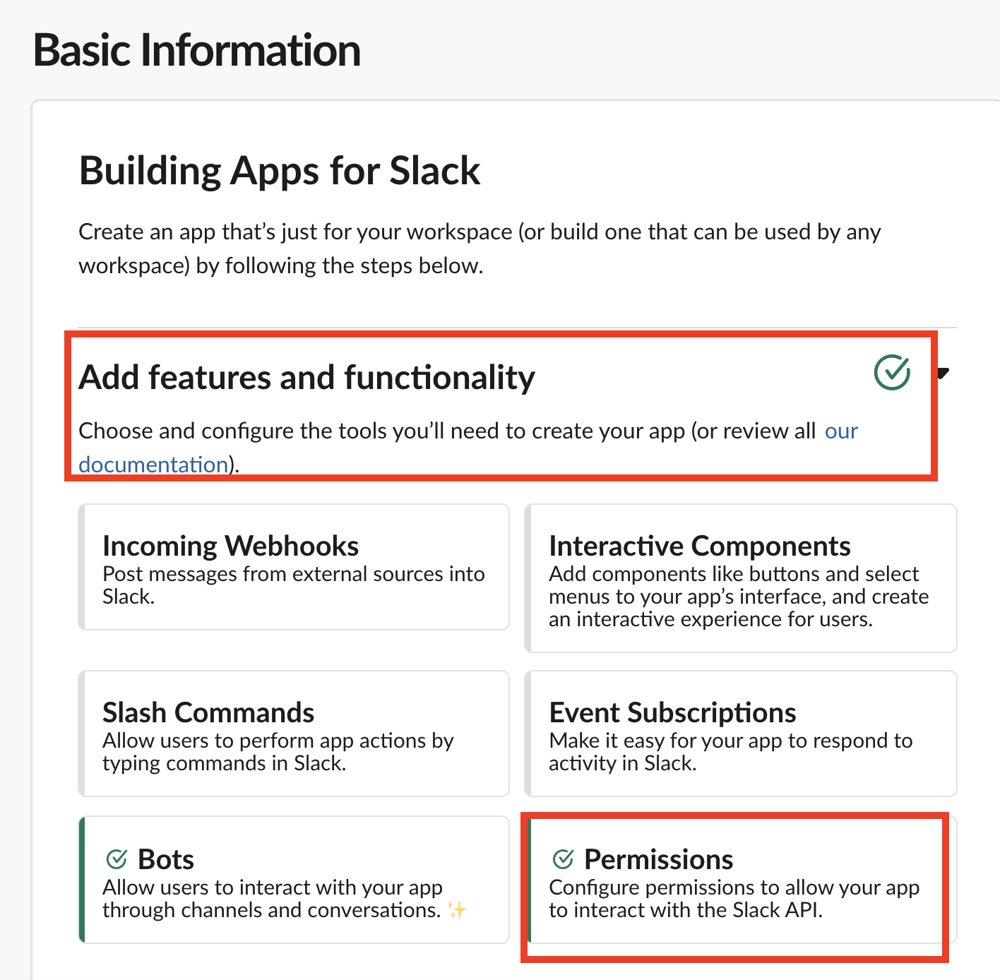
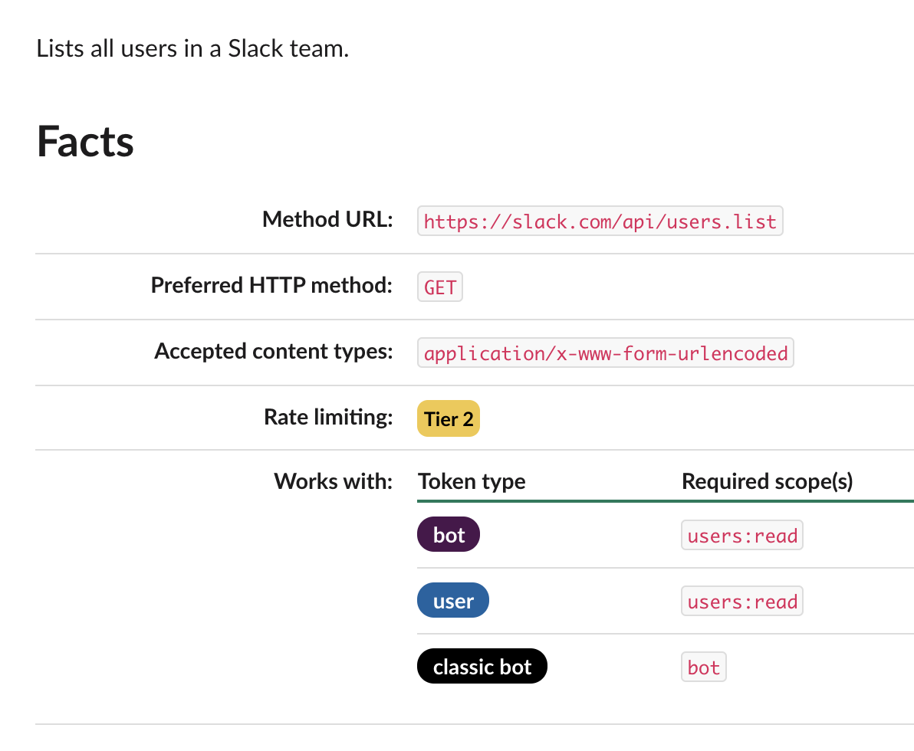

# slack.rb - A Slack Command Line App

## At a Glance

- Individual, [stage 2](https://github.com/Ada-Developers-Academy/pedagogy/blob/master/classroom/rule-of-three.md#stage-2) project
- Due 9AM Monday, *Mar 16*

## Introduction

To practice working with APIs, we will utilize the API for a tool with which you already very familiar: Slack!

Let's talk about how Slack is organized:

| Concept/Term | Definition | Example |
| --- | --- | --- |
| Workspace | Every team/organization's "Slack" is actually a **Workspace.** A Workspace has many channels and has many users. | "Ada Cohort 13"
| Channel | A named conversation topic within a Workspace. Users can send messages to channels. | `#general`, `#random`, and `#fur-babes`
| User | A person who sends and reads messages within a Workspace. Users can send and receive messages directly to other users as Direct Messages | `@dee`, `@kaida`

We will use the Slack API in order to let us list users and channels, get details on users and channels, and send messages to users or channels, all from a Ruby program.

Why would we interact with Slack using its API, and not its web-app? There are many places where you might want to use Slack, where it doesn't make sense to have a human-friendly web-app in the loop. For example, you might set up a continuous integration tool like [Travis CI](https://travis-ci.org/) to run your tests automatically whenever you submit a pull request. Travis has the ability to post in your Slack channel when the tests are done, using the Slack API in a way similar to the way we will in this project.

## Learning Goals

- Sending requests to and receiving responses from an API
- Working with data from an external source
- Mocking an external dependency during testing
- Designing and implementing a program using inheritance

## Objective

We will write a complete command-line application that interacts with Slack. This application will be able to:
- List users and channels
- See details about a user or channel
- Send a message to a user or channel

To accomplish our goal, every pair will:
1. Set up a new Slack Workspace, channels, and users just for this project
2. Write Ruby code to interact with the users and channels from that workspace

## Getting Started

### Scaffolding

We have provided you with our standard Ruby project setup:
- `lib` and `test` folders
  - `lib/slack.rb` is the Ruby file you should use to run the program. There's a bit of code here already - do some research and find out what it does!
  - `test/test_helper.rb` setup to use minitest, simplecov and VCR
- A `Rakefile` and a `Guardfile`
- A `.gitignore` file

Other than this environment, there is no pre-built code for this project. All the project code and all the tests are up to you to create!

### Setup

1. High-five (or fist bump)
1. Fork this repository in GitHub
1. Clone the forked repo: `$ git clone [YOUR FORKED REPO URL]`
1. Create a [new Slack workspace](https://slack.com/get-started).
1. Follow [Ada's Slack Auth Setup instructions](slack_auth_setup.md) to allow your program to talk this Slack workspace.
1. Save your Slack API token in a `.env` file and name your slack token `SLACK_TOKEN`.
1. Add `.env` to your `.gitignore` file.
1. **Add a `filter_sensitive_data` to your [VCR configuration](https://github.com/Ada-Developers-Academy/textbook-curriculum/blob/master/02-intermediate-ruby/api-testing-vcr.md#test-config) in `test/test_helper.rb`**.

**Note: Make sure `.env` is in your `.gitignore` file!**

Lastly, a note to **dear C13**:
Start this project by following these exact setup directions and making your own individual Slack workspace. After a while, if you want to share a Slack workspace with others to help this project feel more collaborative, you may do so after you get started on the project.

### Documentation

Since you'll be working with an external API, it will be good to have the documentation handy. The three endpoints this project will use are:
- [conversations.list](https://api.slack.com/methods/conversations.list)
- [users.list](https://api.slack.com/methods/users.list)
- [chat.postMessage](https://api.slack.com/methods/chat.postMessage)

#### **Scope**

Pay close to the documentation where it lists the "scope" i.e. permissions, that you need to grant your application to use these endpoints.  You can grant scope by going to the **Basic Information** page for your registered Slack application and clicking on **Permissions**.



For example with `users.list` you need to grant the following scope.

- users:read

You can see the scopes required in the documentation below.  



Also if you make a request and your app lacks the required scope you will get a response like the one below which lists the missing scopes.

```json
{
    "ok": false,
    "error": "missing_scope",
    "needed": "users:read",
    "provided": "channels:read"
}
```

## Testing Requirements

For this project, we have provided our standard test infrastructure:
- A `test/` folder containing a `test_helper.rb` file, including
    - Minitest reporters
    - Simplecov
    - VCR
- A `Rakefile`, allowing you to run tests via `rake test`
- A `Guardfile`, allowing you to watch tests via `guard`
- Any tests involving a `User` should use the username `SlackBot`
- Any tests involving a `Channel` should use the `#random` channel

**Do not need to test your main command loop, or the user interaction portions of your app.** However, **all classes and helper methods should be thoroughly tested**. Here are some tips:

- Follow TDD best practices (pseudocode, red, green, refactor)
- Add tests for all code you write
- Make sure all tests are green before pushing to GitHub
- Make sure all tests are green after you pull

## Design Requirements

### Setup `slack.rb` and `Workspace`

Open `lib/slack.rb`. Read through it and answer these questions:

1. What is going on in this file?
2. How do we run this file?
3. What does the line `workspace = Workspace.new` do?

We want every project to have a `Workspace` class. To setup this class, do the following:

1. Create `lib/workspace.rb` and create a class named `Workspace`
1. The `initialize` should not take in any parameters
1. Within `initialize`, the class should set up the instance variables `@users` and `@channels`. Set the value of `@users` to an empty array. Set the value of `@channels` to an empty array. Eventually, these should be refactored so that they are arrays of users or arrays of channels
1. Set `attr_reader` for these two instance variables in `Workspace`
1. Run `$ ruby lib/slack.rb` to make sure that the Ruby program runs without syntax errors. If you get an error that says that `Workspace` is not defined, what line of code do you need to add to the top of `lib/slack.rb` in order to load another class?
1. With your pair, determine: What is the relationship between `Workspace` and a `User`? Is it inheritance or composition? Is-a or has-a or has-many? How do we know from the Ruby code?
1. With your pair, determine: What is the relationship between `Workspace` and a `Channel`? Is it inheritance or composition? Is-a or has-a or has-many? How do we know from the Ruby code?

### Design Activity

[Do this design activity to help set up the classes and overall project design.](design_activity.md)

## Implementation Requirements

Please make sure that you do the design activity before you write code!

### Wave 1 - Listing Channels and Users

As a CLI user, when I launch this program using `$ ruby lib/slack.rb`...

- I should see information about how many channels and users were loaded
- I should then be given three options for how to interact with the program:
  - `list users`
  - `list channels`
  - `quit`

As a user who is at the program's input prompt...

- When I type `list users`, I should see a list of all the users in the Slack workspace. This list should include username, real name, and Slack ID.
- When I type `list channels`, I should see a list of all the channels for that workspace. This list should include the channel's name, topic, member count, and Slack ID.
- When I type `quit`, the program should exit.
- After completing any command other than `quit`, the program should reprint the list of commands and ask for another input.

**Hint:** You may want to investigate the [Table Print gem](https://github.com/arches/table_print) to handle formatting tables.

### Wave 2 - Selecting and Showing Details

**Vocab:** channels and users are both _recipients_.

As a CLI user, when I launch this program using `$ ruby lib/slack.rb`...

- I should see three additional options:
  - `select user`: select a user as the current recipient
  - `select channel`: select a channel as the current recipient
  - `details`: show details on the current recipient

As a user who is at the program's input prompt...

- When I type `select user`, I should be able to supply a username or Slack ID. The corresponding user should be the "selected" recipient.
- When I type `select channel`, I should be able to supply a channel name or Slack ID. The corresponding channel should be the "selected" recipient.
- For selecting both users and channels, if no user/channel has that name or ID, the program should let me know and return to the main command loop.
- When I type `details`, the program should print out details for the currently selected recipient. What information is printed depends on whether it's a channel or a user.
  - If no recipient is currently selected, the program should let me know and return to the main command prompt.

### Wave 3 - Sending Messages

As a CLI user, when I launch this program using `$ ruby lib/slack.rb`...

- I should see one additional option: `send message`.

As a user who is at the program's input prompt...

- When I type `send message`, if a recipient is selected the program should ask me to type out a message, which will be sent to that recipient.
  - If no recipient is currently selected, the program should let me know and return to the main command prompt.

## Optional Enhancements

Don't even think about reading these until all the primary requirements are complete!

- As a user, I can change global settings for the program
  - These settings include the username for the bot and an emoji to use as an icon
  - When I change these settings, the program should save them in the JSON format in a file named `bot-settings.json`. When I restart the program, it should reload those settings.
- As a user, I can see a history of messages sent to the currently selected recipient. If I change recipients, the message list should also change.

If you're done with all that, read through the list of other endpoints for the Slack API, find one that does something interesting, and add it to your program!

## What Instructors Are Looking For
Check out the [feedback template](feedback.md) which lists the items instructors will be looking for as they evaluate your project.
